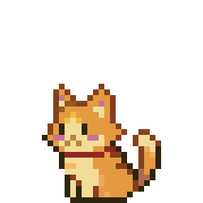
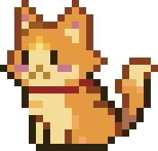
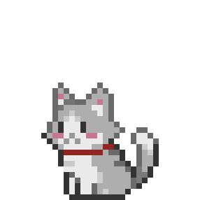
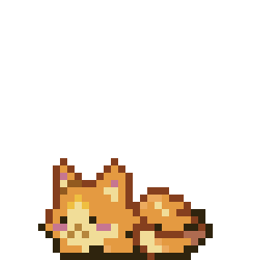

# Pixel Pets - Figma Plugin


A Figma plugin that adds animated pixel art cats to your workspace. Click to spawn pets, drag them around, and watch them blink and wag their tails.

<p align="center">
  
  
  
  
</p>

## Project Structure

```
Figma-plugin/
├── manifest.json      # Figma plugin manifest
├── code.js            # Plugin entry point (opens UI, handles resize)
├── ui-src.html        # Source template with placeholders for SVG data
├── ui.html            # Generated output (built by build.js)
├── build.js           # Build script — injects base64 SVGs into template
└── assets/            # Pixel art SVG sprites (286x286)
    ├── CAT1–4.svg     # Orange cat idle frames
    ├── CATSIT1–5.svg  # Orange cat sitting animation frames
    └── GREYCAT1–4.svg # Grey cat idle frames
```

## How It Works

Figma plugins inline all UI into a single HTML file via `figma.showUI(__html__)`, so external file references aren't possible. The build system solves this:

1. **`ui-src.html`** contains the full UI with placeholders (`__CAT_SVG_DATA__`, `__CATSIT_SVG_DATA__`, `__GREYCAT_SVG_DATA__`)
2. **`build.js`** reads SVGs from `assets/`, base64-encodes them, and replaces the placeholders
3. **`ui.html`** is the generated output that Figma loads

SVGs are rendered using a two-pass canvas approach to avoid pixel art gaps:
1. Render SVG at native resolution (286x286) to an offscreen canvas
2. Downscale to display size (90x90) with high-quality image smoothing

## Build

```bash
node build.js
```

This generates `ui.html` from `ui-src.html` + `assets/`. Run this after modifying any SVG assets or the source template.

## Development

1. Open the Figma desktop app
2. Go to **Plugins → Development → Import plugin from manifest...**
3. Select `manifest.json` from this directory
4. Run the plugin from the Plugins menu

After making changes to `ui-src.html` or assets, run `node build.js` and reload the plugin in Figma.
